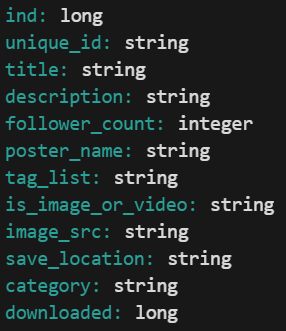

# Pinterest Data Pipeline
---

This project creates a data pipeline from data about Pinterest posts. The data includes information about the post, the geographical information about it, and information about the user. The data is first processed as batch data. It is cleaned and queried with SQL to perform some analysis. The same data is then processed as streaming data to practise skills with Kinesis and PySpark. 


### Skills used:
- AWS (EC2, IAM, S3, MSK Connect, API Gateway, Kinesis, MWAA)
- Databricks
- PySpark
- SQL
- Apache Kafka and Airflow

## Table of Contents

- [1. Dependencies](#1-dependencies)
- [2. Installation](#2-installation)
- [3. The Data](#3-the-data)
- [4. The Pipeline / Usage](#4-the-pipeline)
    * [4.1. Kafka](#41-kafka)
    * [4.2. MSK Connect](#42-msk-connect)
    * [4.3. API Gateway](#43-api-gateway)
    * [4.4. Databricks](#44-databricks)
    * [4.5. Streaming with Kinesis](#45-streaming-with-kinesis)
- [5. Analysis](#5-analysis)
- [6. File Structure](#4-file-structure)

## 1. Dependencies

Install the following python packages before running the project:

- requests
- time
- random
- multiprocessing
- boto3
- json
- sqlalchemy
- urllib
- pyspark

This project uses several services from AWS, so ensure you have an account ready to use. Also ensure that you have a working Databricks account.

## 2. Installation

To begin the project, clone the repo by running the following line in your terminal:

```
git clone https://github.com/kentlisa/pinterest-data-pipeline.git
```

Or, if you have GitHub CLI then run the following:

```
gh repo clone kentlisa/pinterest-data-pipeline
```

## 3. The Data

There are three types of data processed in this project. The first is pin data, which includes the following information:



An example of the pin data.


The geographical data has the following columns:


An example of the geo data.


The user data has the following columns.


An example of the user data.


## 4. The Pipeline
Below are instruction on how to set up and use this data pipeline.

### 4.1. Kafka
> In this section, the IAM User and EC2 instance are created.


Firstly, create an IAM user, then create an EC2 instance in your AWS account and connect to this on your local machine. Install Apache Kafka in you EC2 instance. Using the code snippet below, create three Kafka topics; one for post data (```.pin```), one for geographical data (```.geo```) and one for user data (```.user```).
```
bin/kafka-topics.sh --create --topic topic_name --partitions 1 --replication-factor 1 --bootstrap-server bootstrap_server_string
```
First, navigate to your Kafka folder. Enter the _topic name_ and the _bootstrap server string_ from your MSK cluster, then run this in your terminal. \
These topics will receive the batch data.

### 4.2. MSK Connect
> Here, an S3 bucket is created to store the batch data, and it is connected to the MSK cluster.

Create an AWS S3 bucket to store your data. Download the Confluent.io Amazon S3 Connector and copy it into your S3 bucket. Then create a custom plugin in the MSK connect console. Finally, create a connector using the name of your S3 bucket, and the access role from your IAM user.

### 4.3. API Gateway

> This section creates an API that allows us to send data to our S3 bucket via the MSK cluster.

Create an API with a PROXY integration. Within this resource, create an **HTTP ANY** method. Deploy the API and make a note of the _invoke url_ for use later. Next, install the confluent package for the REST Proxy on your EC2 client machine.\
Start the REST Proxy on your EC2 client machine by navigating to your confluent folder bin, then running the following line in your terminal:
```
./kafka-rest-start /home/ec2-user/confluent-7.2.0/etc/kafka-rest/kafka-rest.properties
```
The ```user_posting_emulation.py``` file contains code to retrieve a random row from each table in the RDS database.
Enter the correct invoke url in this file. Open another terminal, then run the ```user_posting_emulation.py``` file. This send the data to the corresponding Kafka topics. You should find the data stored in your S3 bucket.

### 4.4. Databricks

> In this section, the S3 bucket is mounted to Databricks. The data is then cleaned and analysed. Then, it will be scheduled using

Mount your S3 bucket to your Databricks account. Import the ```pinterest_notebook.ipynb``` file to Databricks. This notebook contains the code to clean and query the data.

The screenshots below contains the code to clean the pin data.

This code drops any duplicate rows that have been imported more than once. Then renames the index column to match the geo and user data.\
The letters (k and M) are removed from the follower count and replaced to give integers.


This snippet shows the code which removes any erroneous data and replaces them with ```None```.


Finally, the ```save_location``` column is cleaned so that it only contains the file path. The columns are then put into a sensible order.


Several SQL queries are then performed to gain insight into the data - see [section 5](#5-analysis)

Create an MWAA environment with an S3 bucket. Set up an MWAA-Databricks connection. Create a DAG to run the notebook daily. Upload the DAG to the MWAA S3 bucket.

### 4.5. Streaming with Kinesis 

> Finally, the same data is streamed using Kinesis and processed and stored in Databricks.

In Kinesis, create a data stream for each topic. 

Add to your API so that it has this structure:


Next, modify the invoke url in the ```user_posting_emulation_streaming.py``` to send the data to each stream. Run this file to initiate the data stream.

Import the ```streaming_pinterest_notebook.ipynb``` notebook into Databricks. Run this notebook to read in the data from the three streams, clean it and send it to Delta tables in Databricks.

The data is cleaned in much the same way as the batch data.

## 5. Analysis

> These SQL queries perform some analysis on the data.

1. **Most popular category in each country** 

    
    Only the first 15 rows are shown here.

2. **Most popular catgeory in each country**

    

3. **Country with the user with the most followers**

    

4. **Most popular catgeory per age group**

    

5. **Median follower count per age group**

    

6. **User sign-ups per year**

    

7. **Median follower count per sign up year**

    

8. **Median follower count per sign up year and age group**

    


## 6. File Structure
```
├─ 0ed442ca38ad-key-pair.pem
├─ 0ed442ca38ad_dag.py
├─ pyspark_notebooks
│  ├─ pinterest_notebook.ipynb
│  └─ streaming_pinterest_notebook.ipynb
├─ python_files
│  ├─ user_posting_emulation.py
│  └─ user_posting_emulation_streaming.py
└─ screenshots
   ├─ api.png
   ├─ pin_data_clean_1.png
   ├─ pin_data_clean_2.png
   ├─ pin_data_clean_3.png
   ├─ sql1.png
   ├─ sql2.png
   ├─ sql3.png
   ├─ sql4.png
   ├─ sql5.png
   ├─ sql6.png
   ├─ sql7.png
   ├─ sql8.png
   ├─ pin_data_example.png
   ├─ pin_cols.png
   ├─ geo_data_example.png
   ├─ geo_cols.png
   ├─ user_data_example.png
   └─ user_cols.png
```

